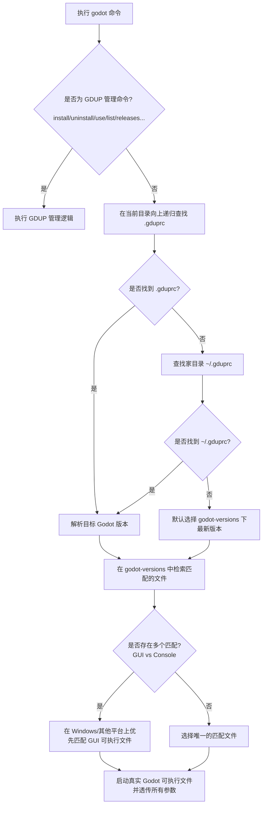

# Godot Version Manager (GDUP)

GDUP 是一个专为 **Godot Engine** 设计的轻量级、无痛且绿色的版本管理器。它采用“透明包装器（Wrapper）”的设计理念，将自身命名为 `godot`（或 Windows 下的 `godot.exe`）。当您执行任何非管理命令时，它会根据当前目录或全局配置，自动且透明地将命令与参数转发给对应的真实 Godot 版本。

---

## 🌟 核心特性

- **透明转发（Transparent Forwarding）**：作为 Godot 启动的拦截器。在日常开发中，您可以像直接使用官方 Godot 一样输入 `godot --editor` 或 `godot -e`，GDUP 会根据项目配置自动调用正确的版本，完全不改变原有的开发习惯。
- **目录级版本隔离**：支持通过项目根目录下的 `.gduprc` 配置文件为不同项目指定不同的 Godot 版本。若当前目录没有配置，它会沿着目录树向上递归查找，或最终匹配用户家目录中的全局 `.gduprc`。
- **在线安装与自动解压**：一键从 GitHub Releases 搜索并下载适用于您当前操作系统的 Godot 版本（支持 Stable 正式版以及 Alpha/Beta/RC/Dev 开发版本）。
- **Windows 无缝集成**：针对 Windows 平台进行了高度优化。编译时使用 `-H windowsgui` 隐藏本身的控制台窗口以防止启动 GUI 编辑器时闪烁黑框；同时，利用 Windows API 在运行命令行模式时自动附接到父进程控制台，实现顺畅的命令行输出。
- **便携与绿色**：不修改系统注册表，所有下载的版本都集中存放在与 `godot` 包装器同级目录下的 `godot-versions/` 中，方便备份或清理。

---

## 🛠️ 工作原理

GDUP 核心是一个透明代理，其工作逻辑如下：



---

## 🚀 安装与设置

### 1. 下载或编译包装器
将本项目编译生成的 `godot.exe`（Windows）或 `godot`（macOS/Linux）放置在一个您专门用于存放开发工具的便携文件夹中。

### 2. 配置环境变量 `PATH`
将包装器可执行文件所在的目录路径添加到系统的环境变量 `PATH` 中。这样您就可以在任意终端（Cmd, PowerShell, Bash 等）中直接输入 `godot` 来使用它。

### 3. 版本存储目录
GDUP 会在包装器所在的同级目录下，自动创建并维护一个名为 `godot-versions/` 的文件夹，所有下载的 Godot 官方版本均会存放于此：
```text
your-tools-path/
├── godot.exe                   # GDUP 包装器二进制文件
└── godot-versions/             # 版本存放目录（自动创建）
    ├── Godot_v4.2.2-stable_win64.exe
    ├── Godot_v4.2.2-stable_win64_console.exe
    ├── Godot_v4.3-stable_win64.exe
    └── ...
```

---

## 📖 常用命令与示例

### 1. 查看可用的 Godot 版本
从 GitHub 获取所有官方可用的发布版本：
```bash
# 仅列出 stable 稳定版本
godot releases

# 列出所有版本（包括 alpha, beta, rc, dev 等测试版）
godot releases -a
```

### 2. 下载并安装指定版本
指定版本号进行安装，GDUP 会自动选择适合当前系统架构的官方包下载并解包：
```bash
# 安装 4.2.2 稳定版
godot install 4.2.2

# 安装 4.3-rc1 测试版
godot install 4.3-rc1
```

### 3. 配置当前项目的 Godot 版本
在您的 Godot 项目根目录下执行 `use` 命令，这会在当前目录生成一个 `.gduprc` 配置文件：
```bash
# 将当前项目指定为使用 4.2.2 版本
godot use 4.2.2
```
`.gduprc` 文件是一个简单的 JSON 配置：
```json
{
  "version": "4.2.2"
}
```

### 4. 列出已安装的本地版本
查看本地已下载的所有版本，带有 `*` 和 `(active)` 标识的为当前目录下生效的版本：
```bash
godot list
# 或使用别名
godot ls
```

### 5. 启动 Godot
在配置了 `.gduprc` 的项目目录下，您可以直接运行以启动 Godot 编辑器或执行命令行指令：
```bash
# 启动项目编辑器 (自动寻找并调用对应版本的 GUI 可执行文件)
godot --editor
# 或简写
godot -e

# 在控制台中直接查看当前项目使用的 Godot 实际版本
godot --version
```

### 6. 卸载不再需要的版本
```bash
# 卸载 4.1.1 版本
godot uninstall 4.1.1

# 静默卸载（免确认确认提示）
godot uninstall 4.1.1 -y
```

---

## 🔨 从源码构建

本项目使用 Go 语言开发，支持跨平台编译。

### 前提条件
- 已安装 **Go 1.25.0** 或更高版本。
- （可选，Windows 环境）安装了 PowerShell。

### 构建步骤

#### 在 Windows 上构建：
直接运行项目根目录下的 `build.ps1` 脚本：
```powershell
./build.ps1
```
该脚本会以如下参数进行安全且优化的编译：
```powershell
go build -ldflags "-s -w -H windowsgui" -trimpath -o godot.exe ./cmd/godot
```
*注：`-H windowsgui` 参数用于剥离默认的 Windows 控制台窗口，避免您直接运行 `godot` 启动编辑器时弹出一个空白的 Cmd 黑框。GDUP 在内部通过 API 实现了有无控制台环境的智能适配。*

#### 在 Linux / macOS 上构建：
```bash
go build -ldflags "-s -w" -trimpath -o godot ./cmd/godot
```

---

## 📄 开源协议

本项目采用 MIT 开源协议，详情请参阅 [LICENSE](LICENSE)（如适用）。
